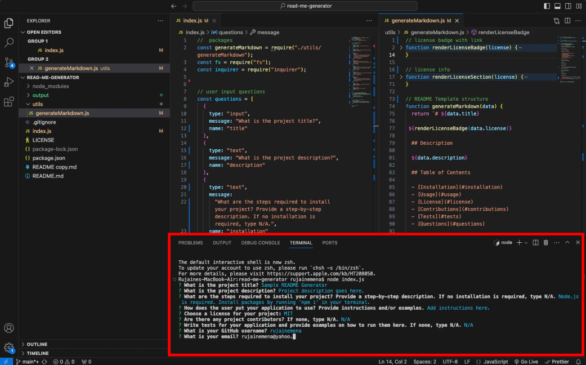

# Professional README Generator

## Description

You can quickly and easily create a README file by using this command-line application to generate one. The app facilitates the documention and allows the user to devote more time to working on the project.


## Table of Contents 

  - [Installation](#installation)
  - [Usage](#usage)
  - [License](#license)
  - [Contributions](#contributions)
  - [Tests](#tests)


## Installation

The application required Node.js. Install the packages by using the following command into your integrated terminal:

```bash
npm install
```

## Usage

The application will be invoked by using the following command:

```bash
node index.js
```


The user will then be prompted to answer questions about their project. 




When the final answer is accepted, a completion message will appear. 


Once the questions have been fulfilled, the README file will be generated with the user's answers and saved into the 'output' directory.


## License

[](https://opensource.org/licenses/MIT)


## Contributions

N/A


## Tests

Tests were conducted in the command line of VS Code. 